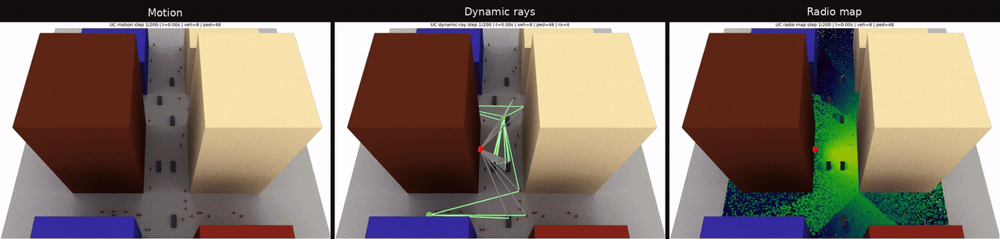
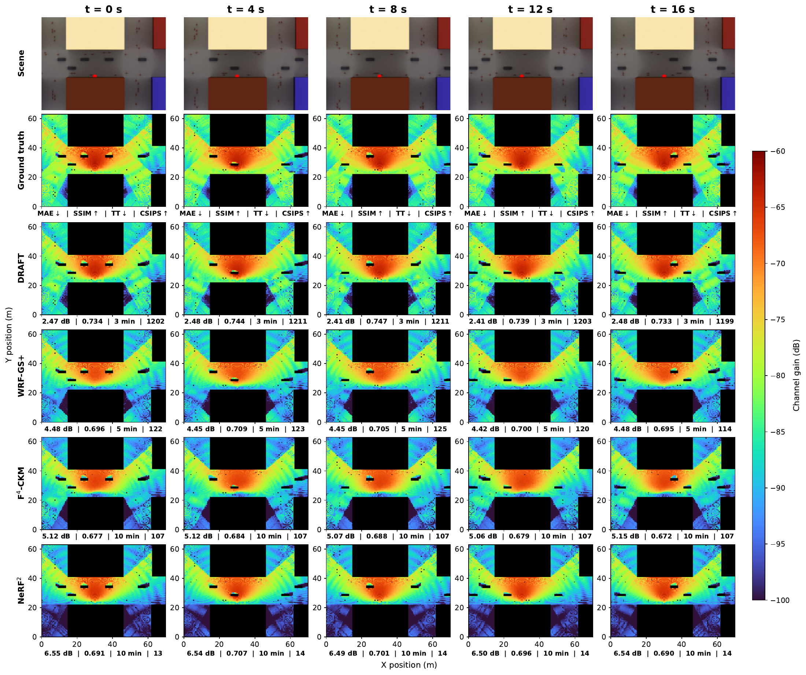

# DRAFT

**Dynamic Radiance Field Transformation for Real-Time CKM Inference**

DRAFT predicts downlink MIMO-OFDM channel state information (CSI) from uplink observations in dynamic wireless environments.

The manuscript is in preparation. Code and reproducibility materials are planned for release after formal acceptance.

## Scene animation

Synchronized scene motion, propagation rays (dynamic components only), and a radio map. This is an environment simulation, not a DRAFT method demonstration.

## Dynamic channel-gain maps

A held-out outdoor scene at 6.7 GHz, with 0.5 m grid spacing.

Each channel-gain map (CGM) is computed as $10\log_{10}(\mathrm{mean}|H_{\mathrm{DL}}|^2)$, averaging complete downlink CSI over subcarriers and antenna pairs. The ground-truth map uses ray-traced CSI.

| Metric   | Meaning                                                                                                                   |
| -------- | ------------------------------------------------------------------------------------------------------------------------- |
| MAE ↓   | Mean absolute gain error in dB.                                                                                           |
| SSIM ↑  | Structural similarity to the ground-truth map.                                                                            |
| TT ↓    | Active training time in minutes, excluding initialization, validation, logging, and saving.                               |
| CSIPS ↑ | Complete CSI samples predicted per second, including input preparation and gain calculation; not image frames per second. |

## Baselines

- [F⁴-CKM](https://github.com/kqzzzz/F4CKM): an RF radiance-field method exploiting antenna and subcarrier correlations for UL-to-DL CSI prediction. We adopt the authors' released implementation.
- [WRF-GS+](https://github.com/wenchaozheng/WRF-GSplus): deformable 3D Gaussians representing static and dynamic RF fields. We reproduce this method based on the authors' released rendering code.
- [NeRF²](https://github.com/XPengZhao/NeRF2): a NeRF-based RF propagation model for UL-to-DL CSI prediction. We adopt the authors' open-source implementation.
